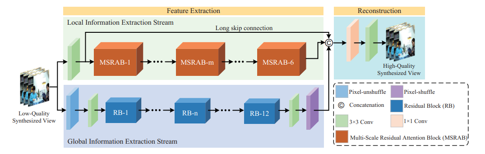

# TSAN

A Two-stream Attention Network (TSAN)-based synthesized view quality enhancement method is proposed for 3D-High Efficiency Video Coding (3D-HEVC). First, the shortcomings of the view synthesis technique and traditional convolutional neural networks are analyzed. Then, based on these analyses, a TSAN with two information extraction streams is proposed for enhancing the quality of the synthesized view, in which the global information extraction stream learns the contextual information, and the local information extraction stream extracts the texture information from the rendered image. Third, a Multi-Scale Residual Attention Block (MSRAB) is proposed, which can efficiently detect features in different scales, and adaptively refine features by considering interdependencies among spatial dimensions.



### Testing

```python
python main.py 
--dir_demo 
test_data 
--data_test 
Demo 
--scale 
1 
--save 
save_path
--pre_train
../experiment/test_downandup_qp30/model/model_best.pt
--test_only
--save_results
```

**Note the architecture of testing_data**

```
|--test_data
	|--0.bmp
	|--1.bmp
	|--2.bmp
    |--3.bmp
```

### Training

```python
python main.py 
```

**Note the architecture of training_data**

```
|--train_data
	|--DIV2K
		|--bin
			|--DIV2K_train_HR
				|--0001.pt
				|--0002.pt
				...
			|--DIV2K_train_LR_bicubic
				|--X1
					|--0001x1.pt
					|--0001x2.pt
					...
		|--DIV2K_train_HR
			|--0001.bmp
			|--0002.bmp
			...
		|--DIV2K_train_LR_bicubic
			|--X1
				|--0001x1.bmp
				|--0001x2.bmp
				...
```

### Requirements

The requirements are listed in `requirements.yaml`. You can use `conda env create --file=requirements.yaml` to build the environment for running our code.

